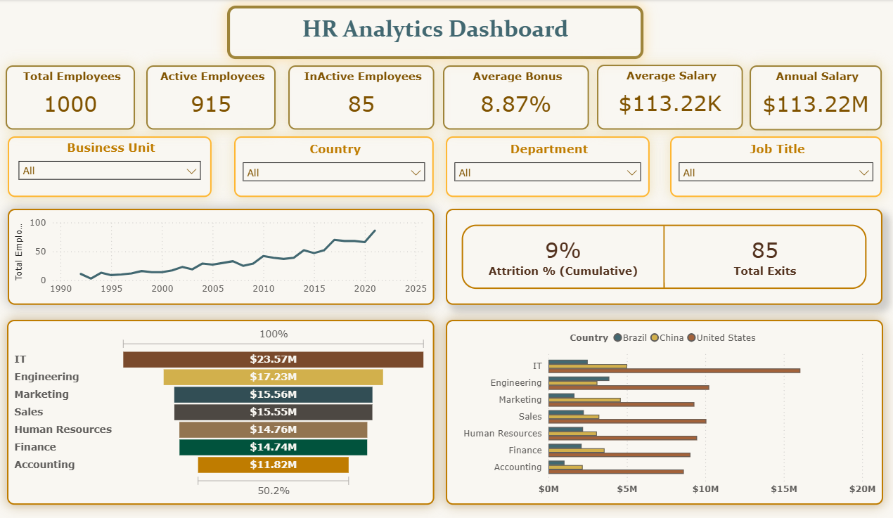
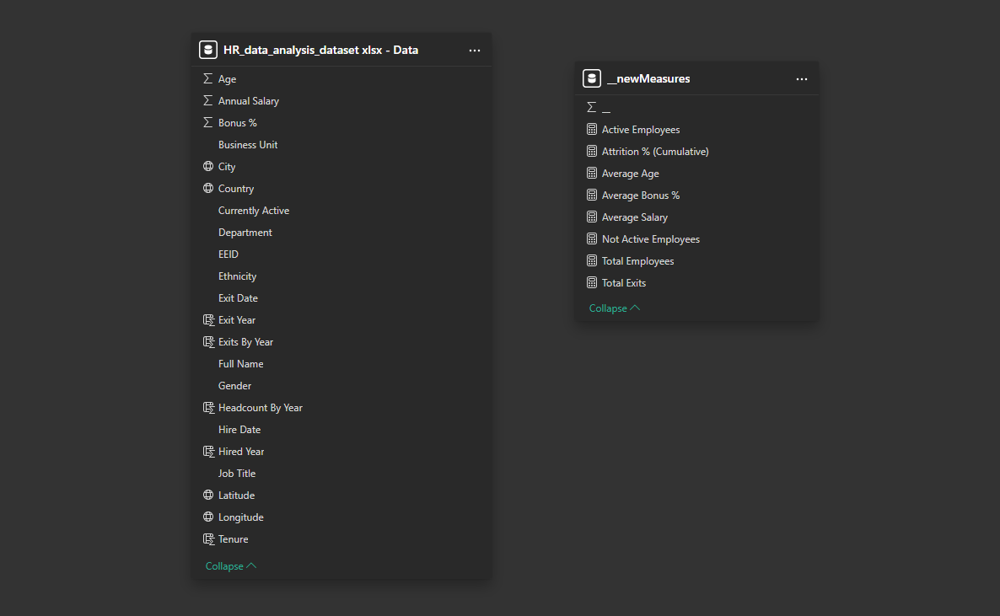

# HR Analytics Dashboard

A complete end-to-end **HR Analytics Dashboard** built using **Power BI** with a flat-table dataset. This project showcases essential HR metrics, data modeling, KPI calculations, and clean dashboard design — perfect for showcasing BI development skills.

## 📸 Dashboard Previews

### **Report View**



### **Data Model**



---

## 📊 Project Overview

This dashboard provides a comprehensive view of workforce analytics, helping HR teams track:

* Employee distribution
* Tenure & experience levels
* Attrition patterns
* Demographics
* Hiring trends
* Key HR KPIs

The project uses a **single flat table dataset**, making it suitable for beginners and ideal for interviews or portfolio display.

---

## 🚀 Features

### **1. Interactive Power BI Dashboard**

* Clean, business-ready visuals
* Button-based navigation
* DAX-driven KPIs
* Page-level filters and slicers

### **2. Flat Table Data Model**

Although a single table is used, the model is optimized with:

* Converted data types
* Custom DAX calculated columns
* Derived metrics (tenure, age band, experience group)

### **3. Practical HR KPIs Covered**

* Headcount
* Tenure
* Attrition
* Hiring analysis
* Gender ratio
* Department-level distribution

---

## 📁 Files Included

### **📌 Dataset**

* `HR_data_analysis_dataset.xlsx - Data.csv`

  * Flat table dataset used for all visuals

### **📌 Power BI Report**

* `HR_data_analysis_dashboard_v1.pbix`

  * Contains all visuals, layouts, KPIs, and DAX logic

### **📌 Screenshots**

* `HR_data_analysis_data_modeling.png` – Data model view
* `HR_data_analysis_report.png` – Dashboard report view

---

## 🧮 Key DAX Calculations

Example metrics used in the dashboard:

### **Tenure (Years)**

```
Tenure = YEAR(DATEDIFF('Data'[Hire Date], TODAY()))
```

### **Age Band**

```
Age Band =
SWITCH(TRUE(),
    Data[Age] < 25, "< 25",
    Data[Age] <= 35, "25-35",
    Data[Age] <= 45, "35-45",
    Data[Age] <= 55, "45-55",
    "> 55"
)
```

### **Attrition Flag**

```
Attrition Flag = IF('Data'[Attrition] = "Yes", 1, 0)
```

---

## 🛠️ Tech Stack

* **Power BI Desktop** (Dashboard design + DAX)
* **Excel/CSV** (Dataset)
* **Data modeling basics** (Flat table)
* **GitHub** (Version control & portfolio presentation)

---

## 🚀 How to Use This Project

1. Download the entire repository
2. Open the `.pbix` file in **Power BI Desktop**
3. If asked, reconnect the CSV dataset from the `data/` folder
4. Explore visuals, modify DAX, or extend metrics

---

## 🎯 Purpose of This Project

This project was built to:

* Demonstrate BI/Power BI dashboard development skills
* Showcase HR domain dashboarding
* Help with BI Developer/Analyst interviews
* Build a strong portfolio piece

---

## 📬 Contact

**Mohamed Khasim**

LinkedIn: [https://www.linkedin.com/in/mohamedkhasim16](https://www.linkedin.com/in/mohamedkhasim16)

Mail-ID: [mohamedkhasim.16@gmail.com]()
---

## 📄 License

This project is licensed under the MIT License.
